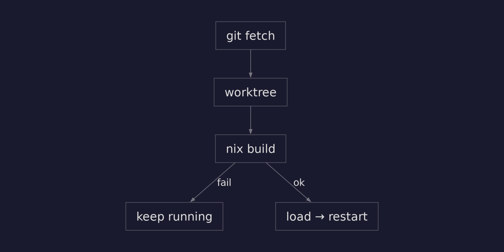

The agent has memory. It talks on Telegram and remembers what you said. But the development loop is painful: change the config, `nix build`, `docker load`, `docker stop`, `docker rm`, `docker run`. Six commands every time you tweak a system prompt.

This iteration closes the loop. A dev launcher watches the capsule's git repo, rebuilds on new commits, and restarts the container automatically. Push a change, the agent updates itself.

The deployment step is the bottleneck. Not building (Nix caches everything) — the manual ceremony around it. If a separate process watches git and handles the build-load-restart cycle, the development loop becomes: edit, commit, push. The launcher handles the rest.

There's a subtlety: what happens when a commit breaks the build? If the launcher pulls broken code and tries to build, the build fails. Now the working copy has broken code, no container is running, and on restart the launcher tries to build from the broken working copy again. The agent is dead until someone manually intervenes.

The solution: never pull until the build succeeds. Build in an isolated space first, only update the working copy after confirming the image loads.

## The launcher

A standalone Nix flake, separate from agent-nix and from adapters. The launcher is a dev tool — it doesn't belong in the agent's schema or the adapter's runtime. Production deployment will use different mechanisms (CI/CD, Kubernetes). The launcher is for the edit-push-test cycle.

```bash
cd my-agent
nix run github:reflection-network/launcher
```

It reads the capsule repo from the current directory, builds the Docker image, starts a container, and enters a poll loop.

## The poll loop

Every 30 seconds (configurable):

```bash
while true; do
  sleep "$POLL_INTERVAL"

  remote_hash="$(get_remote_hash)" || continue
  if [[ "$remote_hash" != "$CURRENT_HASH" ]]; then
    deploy "$remote_hash" || true
  fi
done
```

`get_remote_hash` does `git fetch` + `rev-parse origin/master`. If the remote hash differs from the current one, it triggers a deploy. The `|| true` is critical — without it, `set -e` kills the entire launcher when a deploy fails.

## Safe deploys with git worktree

This is the interesting part. The naive approach — `git pull` then `nix build` — has a fatal flaw: if the build fails, the working copy now has broken code and the launcher can't recover on restart.

The fix uses git worktree to build in isolation:

```bash
try_build() {
  local commit="$1"
  local worktree="$REPO_DIR/.worktree-build"

  git -C "$REPO_DIR" worktree add \
    --detach "$worktree" "$commit"

  if nix build \
       "$worktree#packages...docker" \
       -o "$worktree/result"; then
    docker load < "$worktree/result"
    git worktree remove "$worktree"
    return 0  # success — safe to pull
  else
    git worktree remove "$worktree"
    return 1  # failed — don't touch working copy
  fi
}
```

`git worktree add` creates a second checkout of the same repo at a different path, sharing the same `.git` database. The new commit is checked out there, built, and only if it succeeds does the process continue. The main working copy is never modified.

The deploy sequence:

1. `git fetch` — download new commits (no checkout)
2. `git worktree add .worktree-build <new-hash>` — isolated checkout
3. `nix build` in the worktree
4. If build **fails** → remove worktree, log error, old container keeps running
5. If build **succeeds** → `docker load`, remove worktree, `git pull --ff-only`, restart container

The key invariant: **the working copy always contains the last successfully built code.** Launcher restart → initial build from working copy → always succeeds.



## Image name discovery

The launcher doesn't know the agent's name ahead of time. It could be anything — the capsule decides. Instead of parsing Nix config, the launcher captures the image name from `docker load`'s output:

```bash
load_image() {
  local output
  output=$(docker load < "$1")
  IMAGE_NAME=$(echo "$output" \
    | grep 'Loaded image:' \
    | sed 's/Loaded image: //' \
    | cut -d: -f1)
}
```

`docker load` prints `Loaded image: my-agent:latest`. Parse it, store it, use it for `docker run`. The launcher works with any capsule without configuration.

## Configuration

All via environment variables, all optional:

| Variable | Default | Description |
|----------|---------|-------------|
| `REPO_DIR` | `$(pwd)` | Path to agent repo |
| `CONTAINER_NAME` | `agent` | Docker container name |
| `ENV_FILE` | `$REPO_DIR/.env` | Env file with secrets |
| `CREDENTIALS_FILE` | `~/.claude/.credentials.json` | Claude credentials |
| `POLL_INTERVAL` | `30` | Seconds between checks |

The `.env` file holds the `TELEGRAM_BOT_TOKEN`. Claude credentials are mounted from the host. No secrets in the image, no secrets in the repo.

## The flake

The launcher is a `writeShellApplication` — Nix wraps the bash script with proper PATH setup and runs ShellCheck on it:

```nix
launcher = pkgs.writeShellApplication {
  name = "launch";
  runtimeInputs = with pkgs;
    [ git nix docker coreutils ];
  text = builtins.readFile ./launch.sh;
};
```

`runtimeInputs` ensures `git`, `nix`, `docker`, and `coreutils` are available regardless of the host system. `nix run` handles everything — no install step.

## It works

The development loop is now: edit → commit → push → wait.

```
$ nix run ../launcher
[2026-03-23T...] Launcher started
[2026-03-23T...]   repo:      /home/dev/my-agent
[2026-03-23T...]   container: my-agent
[2026-03-23T...]   interval:  30s
[2026-03-23T...]   commit:    abc1234
[2026-03-23T...] Initial deploy...
[2026-03-23T...] Building Docker image...
[2026-03-23T...] Loaded image: my-agent:latest
[2026-03-23T...] Build complete.
[2026-03-23T...] Starting container my-agent...
[2026-03-23T...] Container started.
[2026-03-23T...] New commit detected: abc1234 -> def5678
[2026-03-23T...] Building def5678 in worktree...
[2026-03-23T...] Loaded image: my-agent:latest
[2026-03-23T...] Stopping container my-agent...
[2026-03-23T...] Starting container my-agent...
[2026-03-23T...] Deploy complete. Running def5678
```

Broken commits are safe:

| Scenario | Container | Working copy |
|----------|-----------|-------------|
| New commit builds OK | Updated | Updated |
| New commit breaks build | Old version keeps running | Unchanged |
| Launcher restart | Rebuilds from working copy | Unchanged |
| Multiple broken commits | Old version keeps running | Unchanged |

## A deeper implication

The launcher doesn't care *who* pushes the commit. It could be a human developer. It could be a CI bot. Or it could be the agent itself.

The agent runs inside a container. Given access to its own capsule repo (or a fork), it can propose changes to its own `flake.nix` — adjust the system prompt, tweak behavior, add context learned from conversations. It commits and pushes. The launcher, running *outside* the container, detects the new commit, builds in a worktree, and if the build succeeds, restarts the agent with the new config.

The mechanism works today. An agent with git access can commit a change to its own system prompt, and 30 seconds later it's running the new version. If the change breaks the build, the old version keeps running. The worktree safety net applies to agent commits just as well as human commits.

Right now there's no approval step — the agent can push whatever it wants. That's acceptable for development, not for production. Approval gates (PR-based review, human-in-the-loop, automated policy checks) are the obvious next layer. But the deployment primitive is already here.
