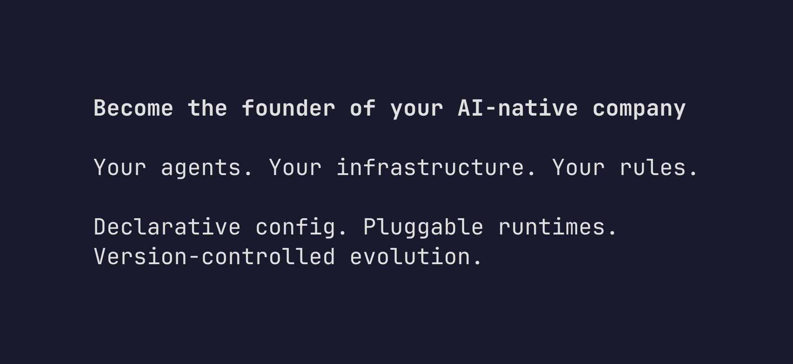

Nine iterations of infrastructure. A schema, two adapters, a launcher, Docker images, persistent storage, documentation. Everything works. But when someone asks "what is Reflection?" the answer keeps changing depending on which piece you're looking at.

This iteration stops building and starts articulating. If we try to explain the product to others, we'll discover what we're actually building.

## Saying what we mean

The landing page says "AI agents defined as Git repos." True, but incomplete. It describes the mechanism, not the product. A Git repo is a container for something — what's inside?

After nine iterations, the pieces form a picture that's bigger than any one of them. A capsule isn't just a config file — it's a job description. An adapter isn't just a translation layer — it's the hiring process. A runtime isn't just an LLM backend — it's an employee doing work.

Reflection is a platform for founding and managing an AI-native company. Not a framework for building chatbots. Not a DevOps tool for deploying containers. A way to think about AI agents as employees in an organization you own.

## The metaphor that fits

Every agent framework uses technical metaphors. Agents are "pipelines" or "graphs" or "chains." These describe implementation. They tell you how to wire things together, not how to think about what you're building.

Classical management theory has a different vocabulary. Roles. Delegation. Oversight. Accountability. Hiring and firing. These concepts map directly onto what we've already built:

- **Capsule = job description.** Name, responsibilities (system prompt), communication channels (transports). Everything an employee needs to know about their role.
- **Adapter = hiring process.** Takes the job description and finds the right runtime. Maybe you hire through Claude Code (adapter-claude), maybe through ZeroClaw (adapter-zeroclaw). The candidate pool keeps growing.
- **`nix build` = onboarding.** Deterministic, reproducible. Every new hire gets exactly the same environment.
- **Git history = performance record.** Every change tracked. Rollback to any previous version. The agent's entire evolution is auditable.

And the human? Not the CEO — the **founder**. Skin in the game. Bears the responsibility. Sets direction. The agents execute, but the founder decides what gets built.

## The landing page

The old tagline: "AI agents defined as Git repos." Technical and accurate. The new one:

**"Become the founder of your AI-native company."**

Below the hero, five feature sections tell the story. Each one shows what's built and what's coming:

**Build your team** — declare agents in config files. Today it's one agent per capsule. Tomorrow it's team management across capsules.

**Own everything** — Git repos you control. No vendor lock-in, no SDK dependency. Fork, branch, version — the workflow developers already know.

**Run anywhere, on anything** — self-hosted today with two runtimes. Hosted platform and more runtimes coming. The key insight: Reflection defines who the agent is. The runtime is a replaceable, constantly improving detail.

**Your company evolves** — version control is already built. Coming next: agents proposing improvements to themselves via pull requests, with you approving the changes.

**You're the founder** — management tooling and observability. Delegation, oversight, accountability. Classical management principles applied to AI teams.

Each feature card carries Built and Coming Soon badges. No aspirational marketing — honest about what exists and what doesn't.

## Architecture docs

The docs site gets an architecture page explaining how the pieces fit together:

```
Capsule ─┐
          ├─ nix build ─→ Deployable artifact ─→ Live Agent
Adapter ─┘
```

A capsule (what the agent is) and an adapter (how to run it) combine through `nix build` into a deployable artifact — a Docker image, a VPS service, a nix-darwin config. Secrets are injected at deploy time, never baked in. Switching runtimes is a one-line change in `flake.nix`: swap the adapter input. The schema grows from real requirements — nothing speculative.

This is the first "Concepts" section in the docs sidebar, sitting above the existing "Guides." Architecture first, how-to second.

## Where we are, where we're going

The product is clear. Reflection Network is a platform for creating and managing AI-native companies. The human is the founder. Agents are employees. Classical management principles apply.

What's built: single-agent capsules, two adapter runtimes, Docker deployment, Git-based version control, persistent storage, dev launcher, documentation.

What's next: multi-agent teams, hosted platform, self-modification via PR, management tooling, observability.

The map exists. Now we know where we're going.


